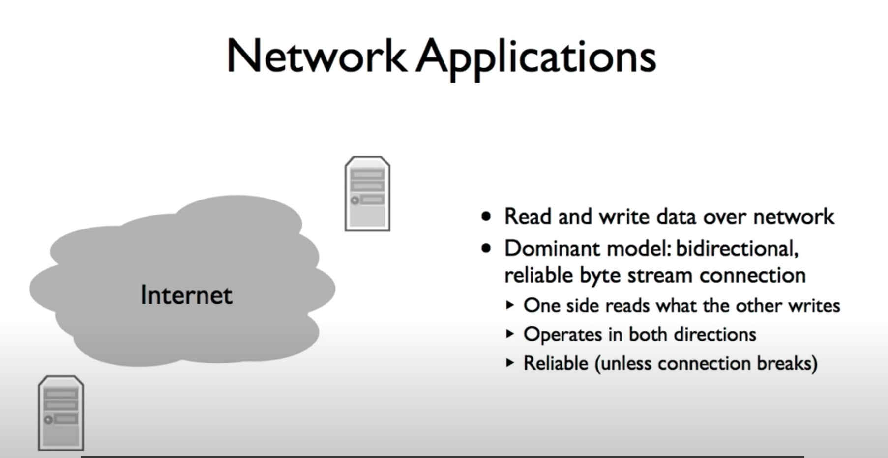
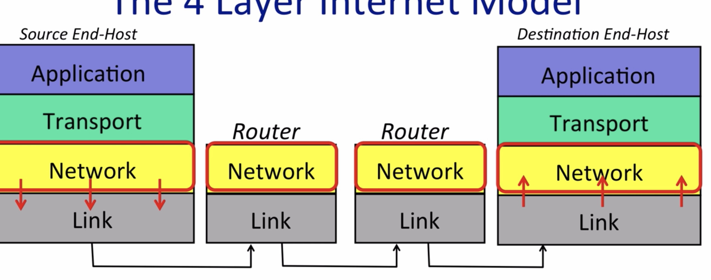
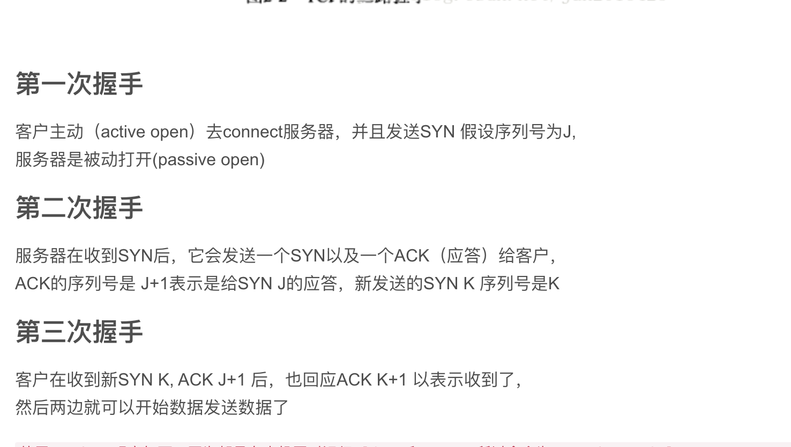
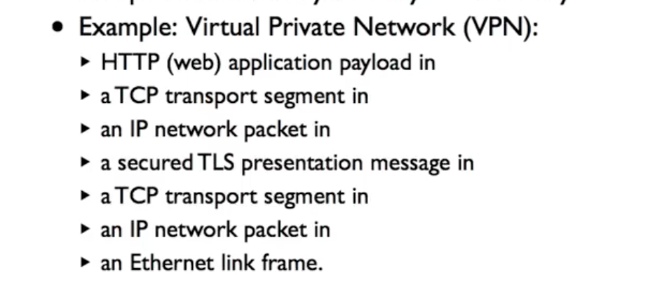
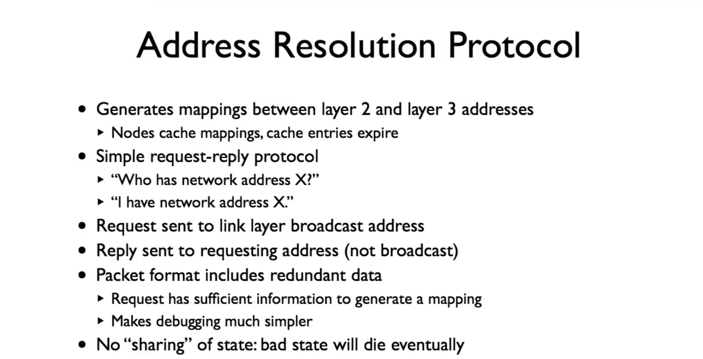

#  CS144 Computer Network

## Lecture 01 Introduction to Computer Networking

### 

双向字节流模式

双方建立连接 可以互相进行写数据和读数据

双方都可以选择关闭连接 用户浏览器端 o r 服务端

World wide web

当使用http://前面的协议

访问网站发送 get请求

200 ok代表成功访问 当然 还会有不同的请求也有不同的响应

http全部使用 ASCII码 格式类似 

### BitTorrent

和http一样的字节流

### SKype

当出现NAT的时候 （地址转换）

打开NAT之后 能连接互联网，而互联网不能访问我们

在这种情况下 我们再使用一个集合服务器

称这种方法为反向链接

当两台客户端都在NAT之后

用中继服务器来连接

www 用客户端和服务器模型

BitTorrent peer-to-peer(点对点)

SKype  集合服务器或者中继服务器

### The 4 layer Internet Model

在网络中 分层是最主要和最核心的概念

#### 链路层

#### 网络层

网络层将数据传给链路层，链路层为网络层提供服务

网络层不关心链路层怎么工作的

数据包发送到internet 必须使用 internet协议

数据包不能保证传送时候万无一失，所以要执行另一个协议

这就是传输层的协议 TCP

#### 传输层

TCP/IP

TCP为应用程序提供服务，确保网络层的正确数据传输

应用程序不需要可靠的网络传输时候

可以使用UDP 协议

只是将数据交给Network

#### 应用层

通常需要双向可靠的字节流

每一层仅与同一层发生链路连接

#### Summary

每一层只和对应的层交流，通过对下一层的api来利用下一层的服务

IP运行在链路层可以通过wifi dsl 3g Ethernet等

#### The7-layer osi Model

不做过多的赘述 因为已经淘汰了

### The IP service model

IP 数据由标头和数据组成

IP 服务模型

类似邮箱服务

发送者和接受者不知道走的路径

IP不能保证数据包到达 必要时会丢弃数据，当堵塞的时候，会丢弃下一个

Ip不会重新发送数据包也不会告诉我们

节省成本 快速的发送数据包

端对端原理

允许在顶部构建各种可信和不可信的服务，IP让应用层选择

适用于任何链路层

尝试限制循环产生的后果

数据包太大会进行分段

用标头检验防止送错

允许新版本的ip 

IPV6的使用

IP允许将新字段添加到报头中

一个IPv4的标头

### A  Day in the life of a packet

CLient and Server

3-way handshake

First way 客户端检测到同步消息时 “Syn"

Second  SYN/ACK

Third Ack

具体内容如下

forwarding table 转发表

看一些真实的数据包

利用wireshark 我这里面访问了自己的blog

那我们如何看网络层内部呢

我们可以使用traceroute工具

可以看到经历多少个网关

通过客户端的web请求 20左右个网关跳转到

### Packet Switching

数据包交换的过程

self routing（不再使用）

forwarding table

不需要知道 packet 属于哪个流

数据流量是突发性的

#### 小结

多个flow可以充分利用link

## Principle :Layering

分层思想

顺序通信 每一层之间相互通信，为上一层提供定义明确的服务

 

分离感使每个层都可以专注完成自己的工作

 邮政服务 分层思想

本人不在乎信如何寄出的

每一层只和相连的上下层有关系

当然 分层思想也在计算机系统里面得到体现

比如一个程序的编译

编译--链接--执行

layer只和上下层的layer交流，下层layer为上层提供了well-defined service，各layer可以随着时间改进而不影响其他层

举例：邮局系统；航空公司；编程

有时为了特殊目的，需要打破layering，比如在c语言中加入assembly code(汇编代码)，使得上层和底层的processor（处理器)不再相互独立。

#### 计算机分层的原因

模块化

定义明确的服务

重用

关注点分离

连续的提高

分层系统独特的(internet)

### Principle:Encapsulation

封装的思想

比如通过web浏览器访问一个网站，发出一个http get请求是tcp段的Payload

封装http get的tcp段是ip数据包的payload  封装了 tcp段和http get的IP数据包是wifi的payload

两种提取数据包的方法

wireshark抓包

封装可以使你递归分层

vpn的原理

## Byte order and packet formats

大端和小端表示法

大端更符合人类的用法，重要的数字在前

一些有趣的测试题

其实蛮简单的就是高位字节如果放在内存的低地址端就是大端模式

相反则是小端模式

而ARM则在大端

协议规范机构会选择一个并坚持下去

但是

## IPV4

网络掩码告诉设备哪些ip地址本地。在同一链接中

同一无线网理论来说不用通过ip路由 直接访问

通过不同掩码进行位运算来判断是不是在本地

在mac的ifconfig里面查看en1

 我的ipv4是192.168.0.20 我的网络掩码是0xfffff00 是255.255.255.0的16进制

所以在192.168.0下的ip可以直接发送

### Quiz

### 分配IP address

A B C 历史上

但是不灵活，所以今天

怎么分配IPV4

IANA 建立多个RIR进行分配

扩展阅读:https://www.cnblogs.com/hark0623/p/6547432.html

一些题目

## LPM

最长前缀匹配

转发表

x为通配符

****

表示为CIDR

### Quiz

## ARP

IP得到Mac地址然后得到网关地址

Addressing Problem: 一个host对应多个IP地址，不容易对应

- 解决方案：gateway两侧ip地址不同，link address确定card，network address确定host
- 这有点历史遗留问题，ip和link address的机制没有完全地分离开，decoupled logically but coupled in practice
- 对于A，ip的目标是B，link的目标是gateway

利用ARP协议把网络层映射到链路层

**ARP，地址解析协议**：由IP得到MAC地址 => 进一步可得到gateway address

- 是一种request-reply protocol

- nodes cache mappings, cache entries expire

- 节点request a link layer broadcast address，然后收到回复，回复的packet有redundant data，看到它的节点都能生成mapping

- reply：原则上unicast，只回传给发送者=>实际实现时更常见broadcast

- No "sharing" of state: bad state will die eventually

- MacOS中保留20min

- gratuitous request: 要求不存在的mapping，推销自己

  ##### 

ARP数据包

e.g.

hardware:1(Ethernet)

protocol: 0x0800(IP)

hardware length:6 (48 bit Ethernet)

protocol length:4(32 bit IP)

opcode: 1(request) /2(reply)

Destination: broadcast (ff:ff:ff:ff:ff:ff)

## Unit1 Summary

了解分层的思想

Internet将数据分解为包，所以理解封装让两个层交互的方法

1.应用层如何使用Internet

2.四层思想

3.互联网协议：IP IPV4

4.网络思想

## Lab0 networking warmup

warmup的实验是要配一个g++环境这样子，然后安装个telnet 写个交互流

我就跟着简单做一遍 

how to fetch a web page

让writing  a. webget

只用我们写一个函数，然后函数的示例代码给我们了

https://cs144.github.io/doc/lab0/class_t_c_p_socket.html

## TCP service model

****

两个应用使用tcp建立通道

TCP三次握手

****

TCP通过fin关闭链接

### TCP的段头

TCP链接unique ID

五个部分，104bit

唯一性

- 要求source port initiator每次increment:64k new connections
- TCP picks ISN to avoid overlap with previous connection with same ID, 多一个域，增加随机性
- ISN的意义在于：1）security，避免自己的window被overlap 2）便于filter out不同类型的包

主机A和主机B链接 包括初始序列号

****

会进行偏移

### TCP端口的分用

## UDP

UDP数据格式

UDP的数据包比较简单

他破坏了分层的思想

并且不保证数据能够传输到达

### UDP的服务模型

* Checksum对于IPv4可选，可以为全0 * checksum用了IP header，违背layering principle，因为能detect错传 * UDP header有length字段，而TCP没有，因为TCP对空间要求高，用隐含的方式计算length * port demultiplexing, connectionless, unreliable

UDP可以不按数据传输，并且不安全，不保证数据能够传输，网络文件系统的早期版本就这样 

DNS使用UDP 使UDP变得快速

## ICMP service model

个人理解相当于一个汇报员

ICMP的type code多样 只需要在线查找即可

### ping命令

调用ICMP. 回显ICMP

### traceroute

所以不断发送udp 改变TTL的大小就可以知道经过哪些路由器和返回的时间

UDP消息发送端口到B，故意选择一个B不知道的端口，这样B会回显一个ICMP消息 unreachable

### Summary

ICMP知道网络层到最终主机和路由器的信息

ICMP介于网络层和传输层之间，一般划分在IP层中

通IP包封装ICMP数据

## End to End principle

只有运输错误检测 没有存储，所以保证到达可以使用端对端，所以TCP也并不是完全可靠

**Why Doesn't the Network Help?**

- e.g.：压缩数据、Reformat/translate/improve requests、serve cached data、add security、migrate connections across the network
- end-to-end principle: function的正确完整实现只依赖于通信系统的end points

end-to-end check

- e.g. File Transfer: link layer的error detection只检测transmission错误，不检测error storage
- e.g. TCP小概率会出错（stack）、BitTorrent
- wireless link相比wire link功能复杂，可靠性低，所以在link layer重传，可提升TCP性能
- RFC1958: "strong" end to end: 不推荐在middle实现任何功能，比如在link layer重传，假定了reliabilty的提升值得latency的牺牲

## Error Detection: 3 schemes

## 

- detect errors的三个算法：checksums, CRC(cyclic redundancy checks), MAC(message authentication codes)

- 增补方式

  - append: ethernet CRC, TLS MAC
  - prepend: IP checksum

- Checksum (IP, TCP)

  - not very robust, 只能检1位错
  - fast and cheap even in software
  - IP, UDP, TCP use one's complement算法：16-bit word packet求和，进位加到底部，再取反码（特例：0xffff -> 0xffff，因为在TCP，checksum field为0意味着没有checksum）

- CRC: computes remainder of a polynomial (Ethernet)，见

  通信与网络笔记

  - 虽然more expensive，但支持硬件计算
  - 可对抗2 bits error、奇数error、小于c bits的突发错(burst)
  - 可incrementally计算
  - e.g. USB(CRC-16):  ，对于generator需要给左边pad 1

- MAC: message authentication code: cryptographic transformation of data(TLS)

  - robust to malicious modifications, but not errors
  - 检错能力有局限，受随机性影响，不如CRC，no error detection guarantee
  -  ，M + c意味着对方有secret或者replay
  - 对于replay，`ctr++`, 具体见[我的密码学笔记](https://github.com/huangrt01/CS-Notes/blob/master/Notes/Output/Cryptography I%2C Stanford University%2C Coursera.md)的TLS部分

所以最好的方法是三种方法组合使用

## Fnite state Machines

FSM example

空闲 请求 请求挂起

### Quiz

FIN wait 1

## Flow control Stop and wait

当发送和接受的速度不同时

所以是发出等待然后再发

### Sliding window

****

- Maintain 3 variables
  - Receive window size(RWS)
  - Last acceptable segment(LAS)
  - Last segment received(LSR)
- Maintain invariant: 
- 如果收到的packet比LAS小，则发送ack
  - 发送cumulative acks: 收到1, 2, 3, 5，发送3
  - TCP acks are next expected data，因此要加一，上个例子改为4，初值为0

**RWS, SWS, and Sequence Space**

- 
- if  , "go back N" protocol ,need SWS+1 sequence numbers (需要多重传)
- if  , need 2SWS sequence numbers
- 通常需要  sequence numbers：考虑临界情况，RWS最左侧的ACK没有成功发送，重传后收到了RWS最右侧的ACK

**TCP Flow Control**

- Receiver advertises RWS using window field
- Sender can only send data up to LAR+SWS

- Maintain 3 variables
  - Receive window size(RWS)
  - Last acceptable segment(LAS)
  - Last segment received(LSR)
- Maintain invariant: 
- 如果收到的packet比LAS小，则发送ack
  - 发送cumulative acks: 收到1, 2, 3, 5，发送3
  - TCP acks are next expected data，因此要加一，上个例子改为4，初值为0

## 选择性重复协议

****

protocol可能的运转方式 (ARQ: automatic repeat request)

- Go-back-N: pessimistic，重传ack, ack+1, ack+2 ...
  - e.g. RWS=1的情形
- Selective repeat: optimistic，重传ack, last_sent, last_sent+1, ...
  - e.g. RWS=SWS=N的情形
  - 对burst of losses效果不好

## TCP Header

- pseudo header：类似2-2，checksum的计算囊括了IP header

- ack: 如果是bi-directional，也携带data信息；如果是uni-directional，好像不携带

- URG: urgent, PSH: push

- ACK: 除了第一个packet SYN，其它seg的ACK都置换为1

- RST: reset the connection

- urgent pointer：和URG联系，指出哪里urgent

  ## TCP Setup and Teardown

  

4次挥手

## Transport Layer

****

